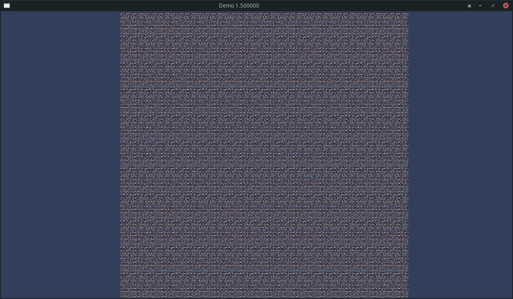
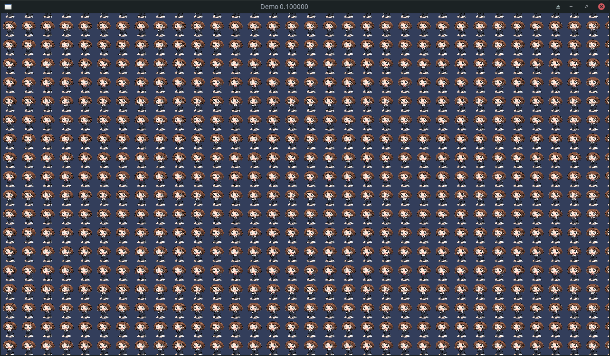

# **Simple Engine**

## **About**
Simple game engine written in C for 2D games creation.

## **Platforms supported**
* GNU/Linux (Engine tested on Manjaro Linux KDE)

## **Dependencies**
### GNU/Linux
* premake5

## **Getting started**
#### GNU/Linux
* git clone https://github.com/vezone/SimpleEngine
* cd SimpleEngine/Scripts/Linux/EngineEditor
* ./generate_project.sh
* ./build_debug.sh

#### Windows (WIP)
* git clone https://github.com/vezone/SimpleEngine
* cd SimpleEngine/Scripts/Windows/EngineEditor
* ./generate_project.bat
* ./build_debug.bat

## **Features**

### 2D Batch Renderer

74 629 textures rended by 1 draw call

Same but zoom = 0.1

Ctrl + Shift + V - preview
